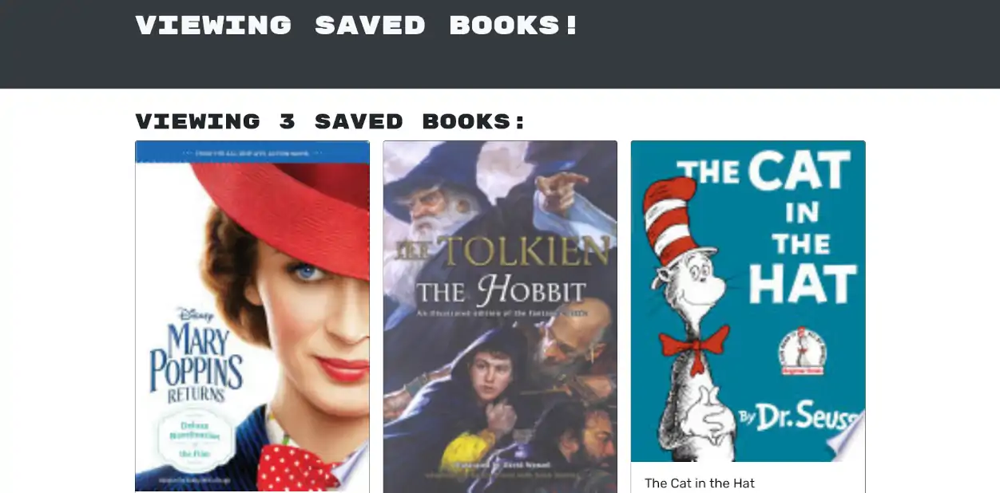

# Google Books Search

## Description 

Google Books Search is a React app that allows you to search for books using Google Books API and save a list of books to your account. Built with React and GraphQL.

---

## Table of Contents 

- [Website](#website)
- [Built With](#built-with)
- [Usage](#usage)
- [Contributors](#contributors)
- [Acknowledgements](#acknowledgements)

---

## Website

https://craigs-books-search.herokuapp.com/

---

## Built With

[Back to Contents](#table-of-contents)

---

## Usage

To use, follow the provided link, sign up to create an account, and search. When you find a book you want to keep, click to save the book to your book list. If you want to remove a book, find the book in your saved books and click to remove.

[Back to Contents](#table-of-contents)
  
---

## Contributors

---
---
    
Craig Bennett

- Converted this app from REST to GraphQL.
    
[Craig5117](https://github.com/Craig5117)

---
---

[Back to Contents](#table-of-contents)

## Acknowledgements

* [React-Bootstrap](https://react-bootstrap.github.io/)
* [apollo-server-express](https://www.npmjs.com/package/apollo-server-express)
* [Tech badges by Ileriayo](https://github.com/Ileriayo/markdown-badges)
* Google Books API

[Back to Contents](#table-of-contents)

---
